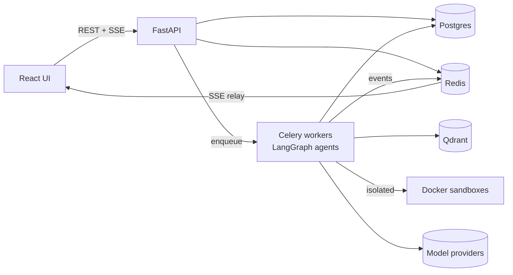

# 🕷️ Spidey

**A production-grade autonomous coding agent platform.** Multi-agent planning, coding, review,
sandboxed testing, debugging, and pull-request delivery over your repositories — engineered so it
is safe to point at untrusted code, with a human approving every destructive action.

<!-- Badges activate at first push / when pipelines are live — no placeholder-lying badges.
CI · CodeQL · Coverage (Codecov) · Python 3.12+ · TypeScript · License: Apache-2.0 · SemVer -->

> **Status: M0 complete** — foundations, platform kernel, CI/security pipeline, compose stack,
> and the evaluation harness are implemented and tested (architecture frozen for v1.0 in the
> [design review](docs/14-design-review.md)). Next: [M1 — identity & API core](docs/04-milestones.md).
> Badges, GIFs, and benchmarks appear as their milestones land.

<!-- hero-gif: docs/assets/hero.gif — full run: goal → plan → approval → diff → tests → PR (M12) -->

## What it does

| | |
| --- | --- |
| 🧠 **Multi-agent runtime** | Planner, Coder, Reviewer, Tester, Debugger, Documenter — orchestrated with LangGraph, durable checkpoints, resumable across restarts |
| 🔍 **Code intelligence** | Tree-sitter parsing (5+ languages), hybrid retrieval (dense + BM25 + knowledge graph), incremental indexing |
| 🛡️ **Hostile-input security** | Repo content treated as attack surface: sandboxed execution (no network, non-root, quotas), prompt/retrieval/memory injection defenses, command allow-lists |
| ✋ **Human-in-the-loop** | Approval gates on every destructive action — durable interrupts, approval inbox, full audit trail |
| 🔌 **MCP-first tool plane** | Serves its tools over MCP; mounts external MCP servers (GitHub, PostgreSQL, browser, custom) with trust tiers and definition pinning |
| 🎛️ **Provider-portable** | Anthropic, OpenAI, Gemini, Azure, Ollama, vLLM — per-role model routing by config only |
| ⏪ **Replayable by construction** | Every run event-sourced: timeline UI, deterministic CI regression replays, comparative re-runs |
| 📊 **Measured, not asserted** | Built-in evaluation framework (pass@k, retrieval P/R, agent success rate, safety corpus) gating CI; full OTel/Prometheus/Grafana/Jaeger observability |

## Architecture

The 30-second version — full detail in [docs/02-architecture.md](docs/02-architecture.md):



**Docs:** [Requirements & threat model](docs/01-requirements.md) ·
[Architecture](docs/02-architecture.md) · [Repo structure](docs/03-repository-structure.md) ·
[Milestones](docs/04-milestones.md) · [Tool plane & MCP](docs/05-tooling-and-mcp.md) ·
[Retrieval](docs/06-retrieval.md) · [Memory](docs/07-memory.md) ·
[Events & replay](docs/08-events-and-replay.md) · [Observability](docs/09-observability.md) ·
[Evaluation](docs/10-evaluation.md) · [Security](docs/11-security.md) ·
[Deployment](docs/12-deployment.md) · [ADRs](docs/adr/README.md)

## Quickstart

Requirements: Docker, Python 3.12+, [uv](https://docs.astral.sh/uv/), make (or use the
[devcontainer](.devcontainer/devcontainer.json) and skip all of that).

```bash
git clone <repo> && cd spidey
cp .env.example .env        # set POSTGRES_PASSWORD + GF_SECURITY_ADMIN_PASSWORD
make bootstrap              # backend deps + git hooks
make dev                    # full stack: API, worker, beat, Postgres, Redis, Qdrant,
                            #             OTel collector, Jaeger, Prometheus, Grafana
curl http://localhost:8000/api/v1/health/ready
```

`make dev-min` starts the core services only; `make test lint typecheck security` runs the local
quality gates. API docs: `http://localhost:8000/api/v1/docs` · Grafana: `:3000` · Jaeger: `:16686`.

## Benchmarks *(published from M4 onward, generated by the eval harness — never hand-written)*

| Suite | Metric | Value |
| --- | --- | --- |
| Retrieval · Codegen · Agent tasks · Safety | P/R@k · pass@k · success rate & cost · injection resistance | *pending M4/M10* |

## Engineering standards

Hexagonal bounded contexts (CI-enforced) · Pyright strict · attack-shaped security tests ·
tiered eval gates in CI · SAST (CodeQL/Semgrep/Bandit) + SBOM + signed releases ·
Conventional Commits, [Keep a Changelog](CHANGELOG.md), SemVer.
See [docs/13-repo-standards.md](docs/13-repo-standards.md) and [CONTRIBUTING.md](CONTRIBUTING.md) *(M0)*.

## License & acknowledgements

[Apache-2.0](LICENSE) *(file lands in M0 — [rationale](docs/13-repo-standards.md#2-community--governance-files))*.
Inspired by the engineering behind Claude Code, Devin, and Codex; built on LangGraph, Tree-sitter,
Qdrant, FastAPI, and the MCP ecosystem.
