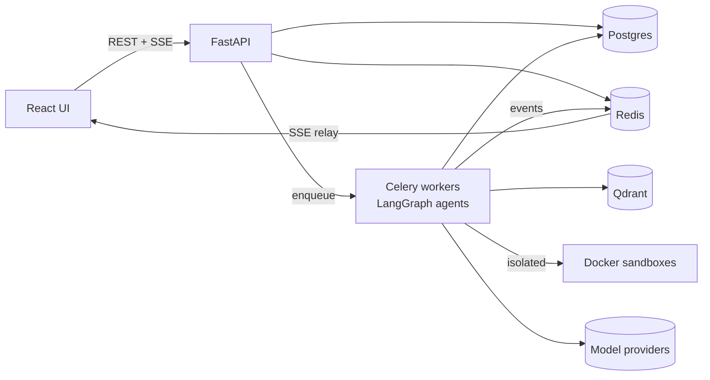

# 🕷️ Spidey

**An autonomous coding agent that plans, writes, reviews, and tests changes across your
repositories — engineered to run safely against untrusted code, with a human approving every
destructive action.**

[](https://github.com/Spideyman198/Spidey/actions/workflows/ci.yml)
[](https://github.com/Spideyman198/Spidey/actions/workflows/codeql.yml)
[](https://github.com/Spideyman198/Spidey/actions/workflows/security.yml)
[](LICENSE)
[](https://www.python.org/downloads/)
[](https://github.com/astral-sh/ruff)
[](https://microsoft.github.io/pyright/)

> **Status:** **v1.0** — all 15 milestones (M0–M15) complete. Security hardened and supply-chain
> gated (SBOM + Cosign signing, license gate, [SEC-\* verification matrix](docs/security/sec-verification-matrix.md),
> [residual-risk register](docs/security/threat-model-residual-risk.md)). See the
> [roadmap](docs/04-milestones.md) and the [changelog](CHANGELOG.md).

## Why Spidey?

Autonomous coding agents are easy to demo and hard to trust. They execute code from repositories
they have never seen, call external tools, and make irreversible changes — usually with no
isolation, no audit trail, and no human in the loop.

Spidey is built the other way around. Repository content is treated as hostile input and agent
actions are reversible by default, so the system is safe to point at real, untrusted code:

- **Untrusted code runs only in ephemeral, network-isolated Docker containers** — non-root,
  read-only rootfs, CPU/memory/PID-capped, with output bounded and secret-scanned.
- **Every destructive action passes a durable human-approval gate** — a file write, a command, or a
  commit pauses the run until a human decides, and the pause survives restarts.
- **Every run is event-sourced and replayable**, so behavior is auditable and reproduces
  deterministically from fixtures.
- **Bounded contexts with CI-enforced import boundaries** keep the architecture honest as it grows.

## Highlights

- ✓ **Multi-agent runtime** — Planner · Coder · Reviewer · Tester · Debugger · Documenter on LangGraph, durable and resumable
- ✓ **Sandboxed execution** — untrusted commands and tests in hardened, network-isolated containers
- ✓ **Human approval gates** — durable interrupts on every destructive action, fully audited
- ✓ **Code intelligence** — Tree-sitter parsing + hybrid dense/BM25/knowledge-graph retrieval, with an eval-gated cross-encoder reranker + context compression
- ✓ **Long-term memory** — typed, attributed, scope-isolated recall behind a fact-only write gate
- ✓ **Event-driven & replayable** — transactional outbox → Redis Streams → SSE; deterministic replay
- ✓ **MCP tool plane** — serves and mounts Model Context Protocol tools with trust tiers and pinning
- ✓ **Provider-portable** — Anthropic, OpenAI, Gemini, Azure, Ollama, vLLM, routed per role by config
- ✓ **Web UI** — React/TS SPA: streaming chat, plan board, diff viewer, approval inbox, live dashboard, replay
- ✓ **Hexagonal architecture** — ports & adapters with import-linter-enforced context boundaries

## Features

- **Multi-agent runtime** — A LangGraph state machine (Planner → Coder → Reviewer → Tester →
  Debugger → Documenter → PR) with durable Postgres checkpoints, editable plans, a bounded fix-retry
  loop, and per-run step/token/cost budgets that halt a runaway into `needs_human`. Runs resume
  across API and worker restarts. → [Architecture](docs/02-architecture.md)
- **Gated PR delivery** — Passing runs open a GitHub pull request only past a durable human
  approval gate; the PR body carries the plan summary and test evidence, and `GET /runs/{id}/report`
  projects the run's timeline into a structured report. → [Tool plane & MCP](docs/05-tooling-and-mcp.md)
- **Sandboxed execution** — Commands and tests run in fresh, disposable Docker containers: network
  `none`, non-root, read-only rootfs, a single writable workspace mount, CPU/memory/PID caps,
  wall-clock kill, and secret-scanned output. An argv-only `CommandPolicy` allow-list decides what
  may run at all. → [Security](docs/11-security.md)
- **Code intelligence** — Tree-sitter parsing across six languages (Python, JavaScript, TypeScript,
  Go, Java, Rust) feeds a hybrid retriever — dense embeddings + BM25 + a Postgres-backed knowledge
  graph — with incremental re-indexing on change. A precision stage adds an **eval-gated
  cross-encoder reranker** (ONNX, hash-pinned) and provenance-exact **context compression**, adopted
  only where the retrieval ablation shows the win. → [Retrieval](docs/06-retrieval.md) ·
  [v2 ablation](docs/perf/m13-retrieval-v2-eval.md)
- **Tool plane (MCP)** — A single `ToolRegistry` choke point enforces RBAC, JSON-Schema validation,
  side-effect gating, and output sanitization. Spidey serves its own tools over MCP and mounts
  external MCP servers with trust tiers and definition pinning. → [Tool plane & MCP](docs/05-tooling-and-mcp.md)
- **Events & replay** — A transactional outbox relays domain events to Redis Streams and a
  cursor-resumable SSE timeline; runs are event-sourced and replay deterministically in CI.
  → [Events & replay](docs/08-events-and-replay.md)
- **Provider gateway** — One `ChatModel` seam spans Anthropic, OpenAI, Gemini, Azure, Ollama, and
  vLLM with per-role routing, fallbacks, retries, budgets, caching, and redacted capture — all by
  configuration. → [ADR-0009](docs/adr/0009-llm-gateway.md)
- **Observability** — OpenTelemetry traces, Prometheus metrics, and Grafana/Jaeger dashboards wired
  from the first milestone. → [Observability](docs/09-observability.md)

## Architecture

The 30-second version — full detail in [docs/02-architecture.md](docs/02-architecture.md):



Modular monolith, hexagonal bounded contexts (identity, workspaces, codeintel, llm, agents,
execution, memory, evaluation) over a shared platform kernel. Full documentation, ADRs, and
per-milestone security reviews live in **[docs/](docs/README.md)**.

## Quickstart

Requirements: Docker, Python 3.12+, [uv](https://docs.astral.sh/uv/), and `make` — or use the
[devcontainer](.devcontainer/devcontainer.json) and skip the local setup.

```bash
git clone https://github.com/Spideyman198/Spidey.git && cd Spidey
cp .env.example .env        # set POSTGRES_PASSWORD + GF_SECURITY_ADMIN_PASSWORD
make bootstrap              # backend deps + git hooks
make dev                    # full stack: API, worker, beat, Postgres, Redis, Qdrant,
                            #             OTel collector, Jaeger, Prometheus, Grafana
curl http://localhost:8000/api/v1/health/ready

# Create the first administrator (first run only):
SPIDEY_BOOTSTRAP_PASSWORD='<a-strong-password>' \
  python -m spidey.identity bootstrap-admin --email you@example.com
```

`make dev-min` starts the core services only; `make test lint typecheck security` runs the local
quality gates. API docs: `http://localhost:8000/api/v1/docs` · Grafana: `:3000` · Jaeger: `:16686`.

For Kubernetes, the Helm chart in [`deploy/helm/spidey`](deploy/helm/spidey) deploys the API (HPA),
KEDA-scaled workers, the beat scheduler, a pre-upgrade migration hook, deny-by-default
NetworkPolicies, and the locked-down namespace for the [Kubernetes Jobs sandbox](docs/12-deployment.md)
— with ops [runbooks](docs/runbooks/) for deploy, backup/restore, rotation, incident response, and
the cost kill-switch.

## Benchmarks

Quality is measured, not asserted. The evaluation harness — retrieval P/R@k, codegen pass@k, agent
success rate and cost, and a safety/injection corpus — runs as tiered gates in CI. Published numbers
are generated by the harness (never hand-written) and land as the live-model suites are wired.
See [docs/10-evaluation.md](docs/10-evaluation.md).

## Engineering standards

Hexagonal bounded contexts (CI-enforced) · Pyright strict · attack-shaped security tests · tiered
eval gates in CI · SAST (CodeQL / Semgrep / Bandit) + dependency audit + signed releases ·
Conventional Commits, [Keep a Changelog](CHANGELOG.md), SemVer. See
[docs/13-repo-standards.md](docs/13-repo-standards.md) and [CONTRIBUTING.md](CONTRIBUTING.md).

## License & acknowledgements

[Apache-2.0](LICENSE). Inspired by the engineering behind Claude Code, Devin, and Codex; built on
LangGraph, Tree-sitter, Qdrant, FastAPI, and the MCP ecosystem.
