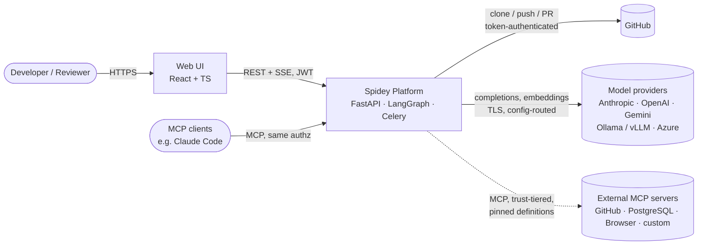
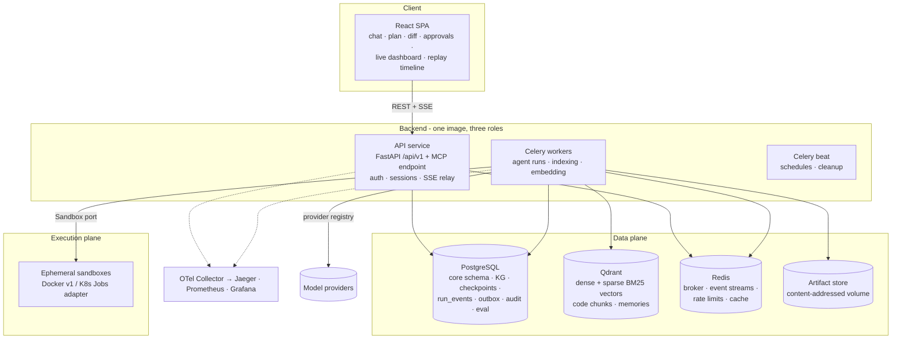
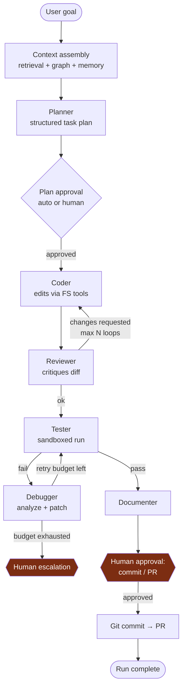
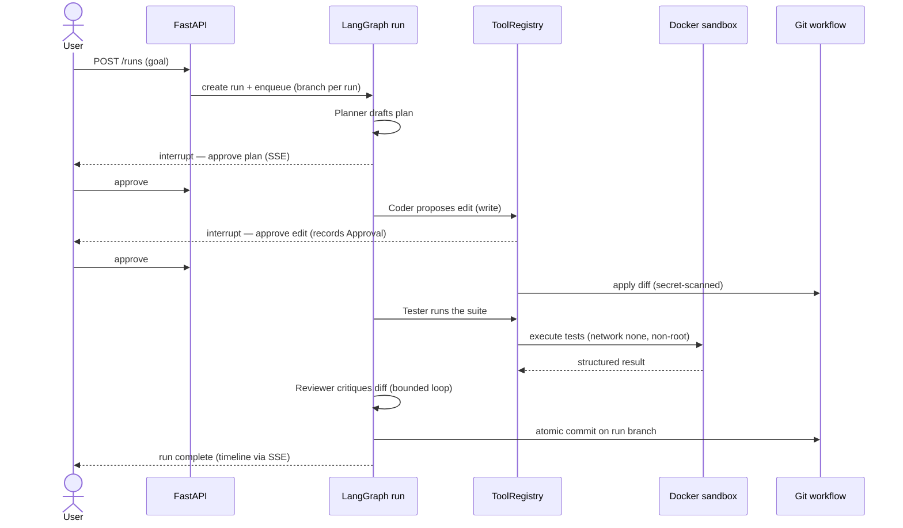
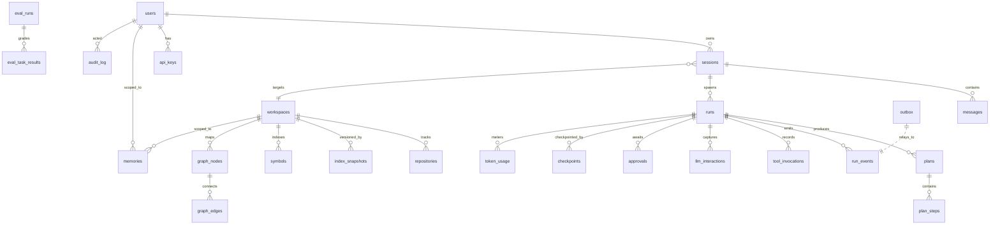

# 02 — System Architecture

This is the hub document: the shape of the system and why. Deep dives live in docs 05–12; every
contestable decision has an [ADR](adr/README.md). Revised in the 2026-07-09 design review
([14-design-review.md](14-design-review.md)).

## 0. Document map

| Doc | Covers |
| --- | --- |
| [05 Tool plane & MCP](05-tooling-and-mcp.md) | Tool registry, native vs MCP providers, discovery, auth, trust tiers |
| [06 Retrieval](06-retrieval.md) | Hybrid search, GraphRAG scope, rerank/compression gates, indexing lifecycle |
| [07 Memory](07-memory.md) | Eight memory components: ownership, retention, indexing, lifecycle |
| [08 Events & replay](08-events-and-replay.md) | Event contracts, outbox, flow, replay modes |
| [09 Observability](09-observability.md) | Per-service exports, traces, metrics, cost & audit planes |
| [10 Evaluation](10-evaluation.md) | Suites, metrics, tiered CI integration |
| [11 Security](11-security.md) | Trust boundaries, AI threats, tooling pipeline, data protection |
| [12 Deployment](12-deployment.md) | Compose v1, Kubernetes/Helm target, sandbox-on-K8s |
| [13 Repo standards](13-repo-standards.md) | OSS/portfolio quality: governance, conventions, workflows |

## 1. Architectural style & principles

**Modular monolith with bounded contexts, hexagonal (ports & adapters) inside each context**
([ADR-0001](adr/0001-modular-monolith.md)).

- One deployable backend image running as API, Celery worker, or beat; contexts communicate only
  through application-service interfaces (CI-enforced via import-linter).
- **domain** (pure, zero I/O) / **application** (use cases over ports) / **infrastructure**
  (adapters) inside every context; heavy testing lands on the first two.
- **Control flow vs facts:** LangGraph edges orchestrate agent runs; domain events record what
  happened for every observer (UI, audit, replay, metrics, memory) — never the reverse
  ([ADR-0011](adr/0011-events-observation-not-control.md)).
- **Provider abstraction over framework abstraction:** our ports (`ChatModel`, `VectorIndex`,
  `Sandbox`, `GraphStore`, `ArtifactStore`) are the seams; frameworks sit behind them
  ([ADR-0009](adr/0009-llm-gateway.md), [ADR-0012](adr/0012-model-provider-registry.md)).
- **Everything is a typed contract:** Pydantic v2 at every boundary; Pyright strict.
- **K8s-shaped from M0** even though v1 ships on Compose ([ADR-0014](adr/0014-kubernetes-readiness.md)).

## 2. C4 Level 1 — System context



## 3. C4 Level 2 — Containers



Streaming ([ADR-0006](adr/0006-sse-streaming.md)): workers publish typed events to a Redis Stream
per run (via transactional outbox); the API relays over SSE with cursor resume. Live dashboard and
historical replay render through the same event reducer — one code path, two time directions.

## 4. Bounded contexts

| Context | Responsibility | Key ports | Key adapters |
| --- | --- | --- | --- |
| `platform` | Shared kernel: config, errors, logging, telemetry, security primitives, **event contracts + outbox** | `EventPublisher`, `ArtifactStore` | pydantic-settings, structlog, OTel, PG outbox, CAS volume |
| `identity` | Users, JWT auth + refresh rotation, RBAC, rate limiting | `UserRepository`, `TokenService` | SQLAlchemy, Redis token bucket |
| `workspaces` | Repo ingestion (local/GitHub), workspace lifecycle, safe FS, git ops, PR creation | `WorkspaceStore`, `GitProvider`, `SafeFileSystem` | GitPython, GitHub REST, path-guarded FS |
| `codeintel` | Tree-sitter parsing, symbols, chunking, embedding, **hybrid retrieval**, knowledge graph | `Parser`, `VectorIndex`, `GraphStore`, `Reranker`(v2) | tree-sitter, Qdrant (dense+sparse), PG graph |
| `agents` | LangGraph orchestration, roles, plans, **tool plane/MCP**, approvals, run lifecycle | `ToolRegistry`, `ToolProvider`, `CheckpointStore` | LangGraph + PG checkpointer, MCP server/client |
| `execution` | Sandbox provisioning, command policy, test execution | `Sandbox`, `CommandPolicy` | Docker SDK (v1), K8s Jobs (M14) |
| `memory` | Conversation history, context assembly, typed long-term memory ([doc 07](07-memory.md)) | `ConversationStore`, `MemoryStore` | Postgres, Qdrant |
| `llm` | **Provider registry**: routing, tool-calling normalization, streaming, retries, budgets, metering, redacted capture | `ChatModel`, `Embedder` | anthropic, openai-compatible (OpenAI/Ollama/vLLM/Azure), gemini |
| `evaluation` | Suites, graders, runners (live/fixture), metrics, baselines ([doc 10](10-evaluation.md)) | `Grader`, `EvalStore` | sandbox grading, PG eval tables |

## 5. Agent orchestration



- **Role-specialized nodes:** each = system prompt (versioned pack) + restricted tool subset +
  structured output schema. The Coder cannot reach the sandbox; only the Tester/Terminal path can.
- **Interrupts as durable state:** approval gates are LangGraph interrupts checkpointed in
  Postgres — approvals can arrive hours later, across restarts ([ADR-0002](adr/0002-langgraph-orchestration.md)).
- **Budgets everywhere:** steps/run, retries/node, tokens/session — exhaustion → `needs_human`,
  never a silent loop.
- **Every transition emits an event**; every node/tool/LLM call is a span. Events feed the product
  (timeline, replay, dashboard); spans feed debugging ([09](09-observability.md) §3).

Node transitions publish the domain events (`TaskCreated`, `CodeGenerated`, `ReviewCompleted`,
`TestsPassed/Failed`, `FixGenerated`, …) defined in [08-events-and-replay.md](08-events-and-replay.md) §3.

### Run sequence — request → agent → sandbox → review → commit

One end-to-end run. Human gates are durable LangGraph interrupts (checkpointed in Postgres), so an
approval can arrive across a restart; the sandbox is the only path that executes repository code.



## 6. Core data model (ERD)



`audit_log`, `run_events`, `tool_invocations`, `llm_interactions` are insert-only (no ORM update
paths + DB trigger guard). Large bodies live in the content-addressed artifact store, referenced by
hash ([ADR-0013](adr/0013-event-sourced-replay.md)). All schema changes via Alembic; every
migration ships a tested downgrade.

## 7. Security architecture — defense in depth

```
Layer 1  Edge:        TLS, CORS allow-list, CSP, security headers, body-size limits
Layer 2  AuthN/Z:     JWT (15 min) + rotating refresh, RBAC per route AND per tool — MCP included
Layer 3  Input:       Pydantic strict validation, rate limiting, request tracing
Layer 4  Agent:       role-scoped tools, side-effect classes, approval gates, budgets,
                      data-framing of ALL untrusted content (retrieval, memory, MCP output),
                      MCP definition pinning, output secret-scan
Layer 5  Execution:   sandbox (no net, non-root, quotas), command allow-list, argv-only
Layer 6  Data:        parameterized SQL, envelope-encrypted tokens, path allow-list,
                      append-only audit, capture-time redaction (replay), PII scrubbing
Layer 7  Pipeline:    gitleaks, Bandit, Semgrep, CodeQL, Trivy, pip/npm audit, SBOM (Syft),
                      Cosign signing, OPA/Conftest on infra, Dependabot, pinned actions
```

Trust boundary diagram and AI-specific threats: [11-security.md](11-security.md).

## 8. Frontend

React 18 + TypeScript + Vite. Server state via TanStack Query; a single typed **SSE event reducer**
renders both live runs (dashboard) and historical runs (replay timeline) — same events, two time
directions. Views: streaming chat, plan board, Monaco diff viewer, approval inbox, live agent
dashboard (FR-6.5: active runs, graph state, tool usage, safe reasoning summaries — never raw
chain-of-thought — tokens/latency/cost, failures), replay timeline, memory manager, settings.
Auth: JWT in memory + refresh in httpOnly SameSite=strict cookie; CSP with nonces; agent-produced
content rendered as text/code only, never `dangerouslySetInnerHTML`.

## 9. Technology decision summary

| Decision | Choice | ADR |
| --- | --- | --- |
| Architecture | Modular monolith, hexagonal contexts | [0001](adr/0001-modular-monolith.md) |
| Orchestration | LangGraph (control flow) + domain events (facts) | [0002](adr/0002-langgraph-orchestration.md), [0011](adr/0011-events-observation-not-control.md) |
| Knowledge graph | Postgres tables + CTEs | [0003](adr/0003-postgres-knowledge-graph.md) |
| Vector + lexical search | Qdrant dense + sparse BM25, RRF | [0004](adr/0004-qdrant.md) |
| Background jobs | Celery + Redis | [0005](adr/0005-celery.md) |
| Streaming | SSE + Redis Streams (outbox-fed) | [0006](adr/0006-sse-streaming.md) |
| Sandbox | Ephemeral Docker; K8s Jobs adapter for K8s | [0007](adr/0007-docker-sandbox.md), [0014](adr/0014-kubernetes-readiness.md) |
| Tool plane | MCP-first: native security-critical tools, pluggable MCP servers | [0010](adr/0010-mcp-tool-plane.md) |
| Model access | Own gateway + provider registry (config-only switching) | [0009](adr/0009-llm-gateway.md), [0012](adr/0012-model-provider-registry.md) |
| Replay | Event-sourced runs + content-addressed artifacts | [0013](adr/0013-event-sourced-replay.md) |
| Deployment | Compose v1, Helm/K8s M14 | [0014](adr/0014-kubernetes-readiness.md) |
