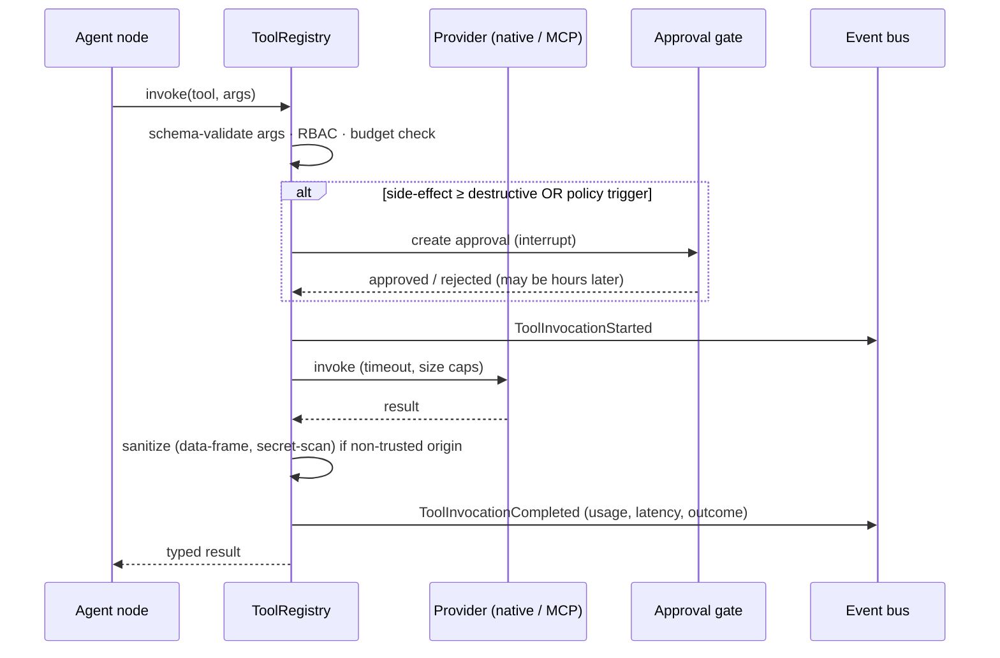

# 05 — Tool Plane & Model Context Protocol

MCP is a **first-class architectural component**: the tool plane's contract *is* MCP-shaped, every
platform capability is servable over MCP, and external MCP servers are the extension mechanism.
What MCP is **not** allowed to be is a security bypass — that tension drives this design.
Decision record: [ADR-0010](adr/0010-mcp-tool-plane.md) (supersedes ADR-0008).

## 1. Concepts

```
ToolSpec        name (namespaced) · version · JSON Schema (input/output) · description
                side-effect class: read | write | destructive
                trust tier: trusted | verified | untrusted
                required role · timeout · cost hint
ToolProvider    anything that contributes ToolSpecs + an invoke() — two kinds:
                  NativeProvider   in-process, our code
                  McpProvider      client connection to an MCP server (stdio | streamable HTTP)
ToolRegistry    the single choke point: registration, RBAC, side-effect gating, approval
                routing, invocation audit, schema validation, metrics
```

Every invocation — regardless of provider kind or caller — flows through the registry. Security
invariants (role scoping, approval gates, audit, budgets) live **there**, so no transport can route
around them.

## 2. Provider matrix

| Capability | Provider | Why this way |
|---|---|---|
| Filesystem | **Native** (`SafeFileSystem`) | Path allow-list, symlink escape prevention, and diff secret-scanning are our security invariants — a third-party FS server would sit outside them. Served *over* MCP, never replaced *by* an MCP server. |
| Git (local) | **Native** (GitPython) | Branch-per-run and commit policy are business rules; same argument as filesystem. |
| Terminal / Docker exec | **Native** (`Sandbox` + `CommandPolicy`) | The most dangerous capability in the system; the allow-list and container hardening are non-negotiable in-process code. |
| GitHub | **Native REST adapter** for the gated PR flow; official GitHub MCP server mountable (`verified` tier) for read-heavy extras (issues, code search) | PR creation must pass our approval gate with our audit trail; read operations gain from the maintained server. |
| PostgreSQL | External MCP server, **read-only credentials, off by default** | Useful for agents inspecting app databases in target repos; never pointed at Spidey's own DB. |
| Browser | External MCP server (e.g. Playwright-based), **off by default**, `untrusted`, network-implication approval | Big attack surface (SSRF, exfiltration channel, injected page content). Valuable for web-app debugging; gated accordingly. |
| Future custom | External MCP servers via config | This is the extension path — zero platform code per new server. |

The rule of thumb the matrix encodes: **security-critical capabilities are native and exposed over
MCP; commodity capabilities are consumed from MCP.**

## 3. Serving (Spidey as MCP server)

- The registry is exported as an MCP server (streamable HTTP endpoint alongside the REST API;
  stdio launcher for local clients such as Claude Code).
- AuthN/Z identical to REST: bearer token → same identity, same RBAC, same rate limits. MCP is a
  transport, not a principal.
- Side-effect classes map to MCP tool annotations (`readOnlyHint`, `destructiveHint`);
  `destructive` tools still require an in-platform approval — the MCP caller receives a pending
  status and the approval happens in Spidey's approval inbox with full audit provenance.
- Rollout: read-only tools (search, graph queries, file read, run status) first; mutating tools
  once the approval-over-MCP flow is proven (M6 → M8).

## 4. Consuming (external MCP servers)

**Discovery & registration**
- Static, reviewed config (`mcp_servers.yaml`): transport, command/URL, credential reference,
  trust tier, enabled tool allow-list. No auto-discovery — a new server is a config change with
  review, by design.
- On mount: `initialize` handshake → `tools/list` → schema validation → tools registered under a
  server namespace (`github.search_issues`), eliminating name collisions and shadowing.

**Tool-definition pinning (rug-pull defense)**
- The tool list + schemas + descriptions are hashed at first mount and pinned in config. On drift
  (server update changes a description or schema), the server's tools are disabled and an operator
  alert fires until the new hash is re-approved. Malicious description swaps after trust is
  established are a documented MCP attack; this closes it.

**Description sanitization (tool-poisoning defense)**
- Descriptions from `untrusted` servers are stripped of imperative/injection patterns before
  entering any prompt, length-capped, and rendered inside the same inert data frames as retrieved
  content.

**Authentication**
- stdio servers are child processes launched with a **scrubbed environment** — only the specific
  variables the server needs, injected from the secret store; no host env inheritance.
- HTTP servers: OAuth 2.1 / bearer per the MCP auth spec, credentials envelope-encrypted at rest.
- Sandbox-adjacent rule: MCP server processes never receive Spidey's own API keys, DB URLs, or the
  Docker socket.

**Runtime containment**
- Per-server budgets: invocation rate, concurrent calls, response-size caps, timeouts.
- Outputs from `untrusted`/`verified` servers are treated as hostile input: data-framed,
  secret-scanned, size-capped before entering agent context.
- An `untrusted` tool can never be classed `read`-equivalent for approval purposes: anything it
  returns may steer the model, so destructive follow-on actions still require human approval in the
  same run.

## 5. Invocation flow



## 6. Failure semantics

MCP server death or timeout is an expected condition: the invocation returns a typed
`ToolUnavailable` result (never an exception that kills the run), the node decides whether to
re-plan or escalate, and repeated failures trip a per-server circuit breaker with an operator
metric. stdio servers are supervised child processes with restart-with-backoff.
