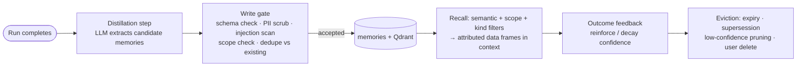

# 07 — Memory Architecture

Eight memory components, one honest storage design: two **live** memories (working, conversation)
and one **long-term memory system** holding five typed record kinds behind a single store and
lifecycle. They are separated by *contract* (ownership, retention, indexing, write/read paths) —
not by inventing eight databases.

## 1. Component matrix

| Component | Contents | Owner context | Store | Indexed by | Retention / lifecycle |
|---|---|---|---|---|---|
| **Working memory** | Current graph state: messages in flight, tool results, plan progress, budgets | `agents` | LangGraph checkpoint (Postgres) | run_id | Per run; checkpoints kept for replay window, then compacted |
| **Conversation memory** | Full message history + rolling summaries of older turns | `memory` | Postgres | session_id, time | Per session; summaries regenerated as history grows; user-deletable |
| **Repository memory** (LT) | Distilled facts about a repo: conventions, build quirks, layout, gotchas | `memory` | Postgres record + Qdrant embedding | workspace_id + semantic | Cross-session; refreshed on re-ingestion; invalidated when cited files change |
| **Semantic memory** (LT) | Cross-repo engineering knowledge the system has validated ("pytest-asyncio needs X") | `memory` | Postgres + Qdrant | semantic | Slow decay; confidence-weighted; capped size with relevance eviction |
| **Procedural memory** (LT) | Playbooks: action sequences that worked ("to run tests here: uv sync → pytest -x") | `memory` | Postgres (structured steps) + Qdrant | workspace_id + task type | Reinforced on reuse success, decayed on failure |
| **Episodic memory** (LT) | Run summaries: goal, approach, outcome, cost — with link to full replay | `memory` | Postgres + Qdrant | workspace_id, time, outcome | Summaries kept long-term; full event detail per replay retention (doc 08) |
| **Evaluation memory** (LT) | Benchmark outcomes per model/prompt/config — what works | `evaluation` | Postgres (eval_runs) | suite, model, config hash | Permanent; feeds routing and prompt decisions; rendered in Grafana |
| **Long-term memory** | The umbrella system over the five typed kinds above: one schema, one recall API | `memory` | `memories` table + Qdrant `memories` collection | type + scope + semantic | See lifecycle below |

## 2. Long-term record schema

```
Memory {
  id, kind: repository|semantic|procedural|episodic|evaluation,
  scope: {workspace_id? , user_id?},          # hard recall boundary
  content,                                     # the fact / playbook / summary
  provenance: {run_id, source_refs[], distilled_by},
  confidence: float, use_count, last_used_at,
  created_at, expires_at?, superseded_by?
}
```

## 3. Lifecycle



- **Write path:** only the distillation step (and explicit user "remember this") writes long-term
  memory. Agents cannot write memories mid-run — that would make memory a prompt-injection
  persistence mechanism.
- **Write gate:** every candidate passes PII scrubbing, instruction-pattern scanning (a memory is a
  fact, never an imperative), scope validation, and dedupe/supersede matching before storage.
- **Recall:** context assembly requests memories by kind + scope + semantic similarity under an
  explicit token sub-budget; results enter prompts as *attributed data* ("previously observed,
  confidence 0.8, from run #142"), never as instructions. Priority order in context:
  system > plan > procedural/repository memory > retrieved code > conversation.
- **Feedback:** when a run that recalled memory M succeeds, M's confidence is reinforced; on
  failure it decays. Poisoned or stale memories thus die from evidence, not just curation.
- **User sovereignty:** memories are user-inspectable and deletable via API/UI (FR-5.3); deletion
  removes both record and vector — verified by test.

## 4. Isolation rules

- Recall never crosses `workspace_id` for repository/procedural/episodic kinds; semantic memories
  are the only cross-repo kind and carry no repo-identifying content (enforced at the write gate).
- Memory content is treated as untrusted at read time even though we wrote it (defense in depth
  against gate bypass): same inert framing as retrieval.
