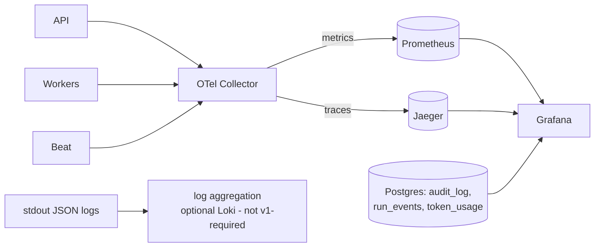

# 09 — Observability

Three signals (logs, traces, metrics) + two derived planes (audit, cost), one pipeline. Everything
flows through the OpenTelemetry Collector so backends are swappable config, not code.

## 1. Pipeline

- **Jaeger** as the trace backend: purpose-built UI for span-level debugging, all-in-one container
  for compose. (Grafana Tempo was the alternative — better Grafana integration, weaker standalone
  trace UX; either is a collector config swap, which is the point of the collector.)
- Logs go to stdout as structured JSON (12-factor); Loki is documented as optional — for v1,
  `docker compose logs` + trace-id grep is sufficient and one less service.

## 2. What every service exports

| Service | Traces | Metrics (Prometheus) | Logs |
|---|---|---|---|
| **API** | HTTP server spans (route, status), DB/Redis client spans, SSE session spans | `http_request_duration_seconds{route,method,code}`, `http_requests_in_flight`, `rate_limit_rejections_total`, `sse_active_streams` | request logs with trace_id, auth events |
| **Workers** | Task spans (linked to enqueuing API trace via propagated context), agent-run child spans, LLM/tool/sandbox spans | `celery_task_duration_seconds{task,queue}`, `celery_queue_depth{queue}`, `task_retries_total`, `index_files_processed_total`, `index_duration_seconds` | task lifecycle, agent step logs |
| **Agent runtime** | **Span per graph node** (planner/coder/…), span per tool invocation, span per approval wait | `agent_runs_total{outcome}`, `agent_node_duration_seconds{node}`, `agent_steps_per_run`, `approvals_pending`, `approval_wait_seconds`, `run_budget_exhaustions_total{budget}` | node transitions (= events) |
| **LLM gateway** | Span per call, `gen_ai.*` semantic-convention attributes (system, model, token counts) — **prompt bodies are NOT span attributes**; spans carry the `llm_interactions` ref | `llm_tokens_total{model,kind}`, `llm_call_duration_seconds{model}`, `llm_cost_usd_total{model,session}`, `llm_errors_total{model,type}`, `llm_retries_total`, cache hit ratio | call metadata only |
| **Tool plane** | span per invocation | `tool_invocations_total{tool,outcome,side_effect}`, `tool_duration_seconds{tool}`, `mcp_server_up{server}`, `mcp_circuit_open{server}` | invocation records → audit |
| **Sandbox** | span per execution | `sandbox_executions_total{outcome}`, `sandbox_duration_seconds`, `sandbox_oom_kills_total`, `sandbox_timeouts_total`, `policy_violations_total{rule}` | command + verdict (argv, no output bodies) |
| **Frontend** | — (v1: no RUM; noted as optional) | — | console errors to Sentry-style endpoint: deferred |

**Trace completeness invariant:** one user request that triggers an agent run yields **one
connected trace**: API → Celery (context via task headers) → every graph node → every LLM call →
every sandbox execution. Verified by an integration test that walks the exported span tree.

## 3. Agent traces vs. events

Spans and domain events (doc 08) are deliberately redundant: spans for latency-shaped debugging in
Jaeger, events for durable product-facing history (timeline, replay, audit). Both carry the same
`run_id`/`trace_id` correlation, so you can pivot between them. Events are never sampled; traces
may be (head sampling stays 100 % in v1, knob exists for scale).

## 4. Cost plane

Cost is a first-class metric, derived once in the LLM gateway (tokens × configured price table per
model/provider) and emitted three ways: `token_usage` rows (exact, per call, for billing-grade
queries), Prometheus counters (for dashboards/alerts), and `LlmCallCompleted` events (for the run
timeline: "this step cost $0.41"). Budgets alert at 80 % and hard-stop at 100 % per session/run.

## 5. Audit plane

`audit_log` is **not telemetry**: append-only Postgres, insert-only enforced by trigger, no
retention trimming, covering security-relevant actions — authn events, authz denials, approvals
(who/what/when/decision), destructive tool executions, policy violations, secret-scan hits, config
changes. Audit rows link to trace_id for investigation but never depend on the telemetry stack
being up.

## 6. Dashboards & alerts (as code, `infra/grafana/`)

Dashboards: **Platform** (API latency/errors, queue depth, DB/Redis health) · **Agent operations**
(active runs, node durations, outcomes, approval latency, budget exhaustions) · **Cost** (spend by
model/session/day, tokens, cache savings) · **Retrieval & index** (search latency, index freshness,
suspect-content flags) · **Sandbox & security** (executions, violations, MCP circuit states) ·
**Evaluation** (suite scores over time, regressions — from eval tables).

Alert seed set: p95 API latency, queue depth sustained, run failure rate, cost/hour anomaly,
sandbox policy violations > 0, MCP tool-definition drift, audit-write failures (page immediately).
