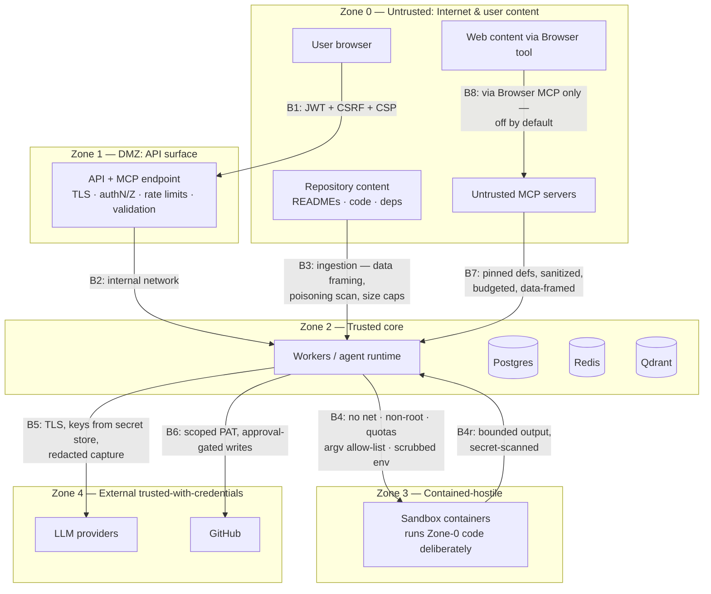
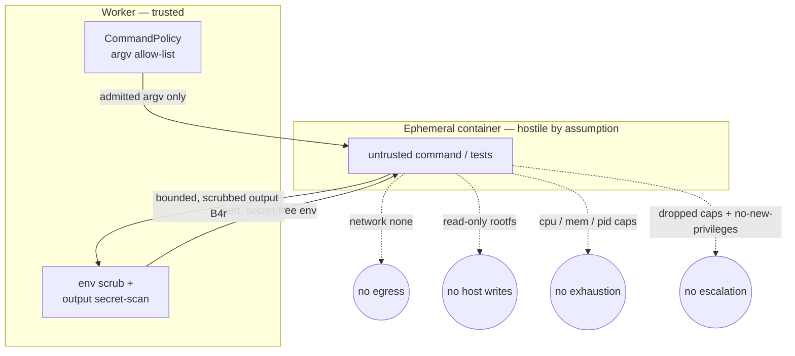

# 11 — Security Architecture

Extends the threat model in [01-requirements.md §5](01-requirements.md); this document adds trust
boundaries, the security tooling pipeline, AI-specific defenses, and the updated STRIDE entries
from the design-review pass. Per-milestone review reports land in `docs/security/`.

## 1. Trust boundary diagram

Every boundary (B1–B8) has: named controls, attack-shaped tests in `tests/security/`, and audit
events on violation. **The defining asymmetry of this system:** Zone 3 exists to *deliberately
execute* Zone-0 content — so B4 is engineered as if compromise of the sandbox interior is routine,
and the security property defended is the B4 wall, not sandbox-interior integrity.

### The B4 sandbox boundary

The trusted worker admits only argv the `CommandPolicy` allow-list permits and hands the container a
scrubbed, secret-free environment. The container is treated as hostile: no network, a read-only
rootfs with a single writable workspace mount, dropped capabilities, and CPU/memory/PID caps. Output
comes back bounded and secret-scanned (B4r) before it can re-enter a prompt.

## 2. AI-specific threats (STRIDE additions from this review)

| Threat | Vector | Controls |
| --- | --- | --- |
| **Tool poisoning / rug pull** | Malicious or updated MCP tool descriptions steering the model | Definition pinning + drift alarm, description sanitization, namespace isolation, trust tiers (doc 05 §4) |
| **Memory poisoning** | Injected content distilled into long-term memory, persisting across sessions | Write gate (instruction-pattern scan, provenance, scope), inert framing at recall, confidence decay on failure, user-visible memory (doc 07 §3) |
| **Retrieval poisoning** | Adversarial chunks planted in repos to hijack later searches | Index-time instruction-pattern screening → `suspect` flag, provenance data-framing at prompt time, safety eval corpus regression (docs 06 §3, 10 §2) |
| **PII leakage** | Personal data in repos/conversations flowing to logs, memories, or LLM providers | PII scrubbing processors at three choke points: log pipeline, memory write gate, replay capture; documented data-flow to providers |
| **Judge/eval gaming** | Prompt content that manipulates LLM-judge grading | Execution-based grading wherever possible; judges get data-framed inputs; human agreement audits |
| **Model/prompt supply chain** | Compromised prompt packs or eval baselines altering behavior | Prompts and baselines are code: reviewed, versioned, replay-gated (T1 must pass or explicit re-bless) |

## 3. Security tooling pipeline

| Stage | Tool | Purpose | Gate |
| --- | --- | --- | --- |
| pre-commit | gitleaks | secret scan (diff) | block commit |
| pre-commit | ruff + pyright | injection-prone patterns, type holes | block commit |
| CI: SAST | **Bandit** | Python security anti-patterns | fail on high |
| CI: SAST | **Semgrep** | custom rules: raw SQL, subprocess-with-shell, unsafe deserialization, `SafeFileSystem` bypass (direct `open()`/`os.path` in contexts), event-outbox bypass | fail on any custom-rule hit |
| CI: SAST | **CodeQL** | deep dataflow analysis (Python + TS) | fail on high; runs as GitHub workflow |
| CI: secrets | gitleaks (full history) | catch what pre-commit missed | fail |
| CI: deps | pip-audit / npm audit + **Dependabot** | known-vuln dependencies; automated update PRs | fail on high with no advisory exception |
| CI: containers | **Trivy** | image + filesystem + IaC scan (backend, sandbox, compose/K8s configs) | fail on critical |
| CI: policy | **OPA/Conftest** | policy-as-code on Dockerfiles & K8s manifests: non-root, no privileged, resource limits present, no `:latest` | fail |
| CI: SBOM | **Syft → CycloneDX** | SBOM per image, attached to release artifacts | informational + license check fail |
| Release | **Cosign** (keyless, GitHub OIDC) | sign images + SBOM attestation; verification documented in deploy guide | release checklist |
| Nightly | safety eval suite | prompt-injection/poisoning regression (doc 10) | auto-issue on regression |

**OPA scoping decision:** OPA is adopted **at CI time only** (Conftest over infra files). Runtime
policy (command allow-list, tool gating, path policy) stays **typed, unit-tested Python** — those
policies need rich context (schemas, budgets, approval state), and a Rego sidecar would add a
service + a second language for logic that must be test-covered with the code it protects.
Documented trade-off: we give up hot-reloadable runtime policy, which v1 does not need.

## 4. Supply chain

Hash-pinned lockfiles (uv.lock, package-lock) · lockfile-only installs in CI/images ·
multi-stage distroless-leaning runtime images, non-root · pinned GitHub Actions (by SHA) ·
Dependabot for deps *and* actions · SBOM + Cosign as above · no dependency on unpinned model
artifacts (reranker models, when adopted, are hash-pinned).

## 5. Data protection

- **In transit:** TLS at the edge (reverse proxy in compose; ingress + cert-manager on K8s);
  internal compose network isolated; K8s NetworkPolicies deny-by-default (doc 12).
- **At rest:** user-supplied tokens (GitHub PAT, provider keys) envelope-encrypted (AES-GCM data
  keys under an env-provided master key; KMS port for later); replay bodies redacted at capture;
  full-disk encryption is deployment guidance, not app scope.
- **Secrets management:** pydantic-settings from env only; `.env.example` documented;
  K8s: External Secrets Operator or SOPS-encrypted values (doc 12 §4); secrets never in
  ConfigMaps, logs, spans, events, or checkpoints (tested).
