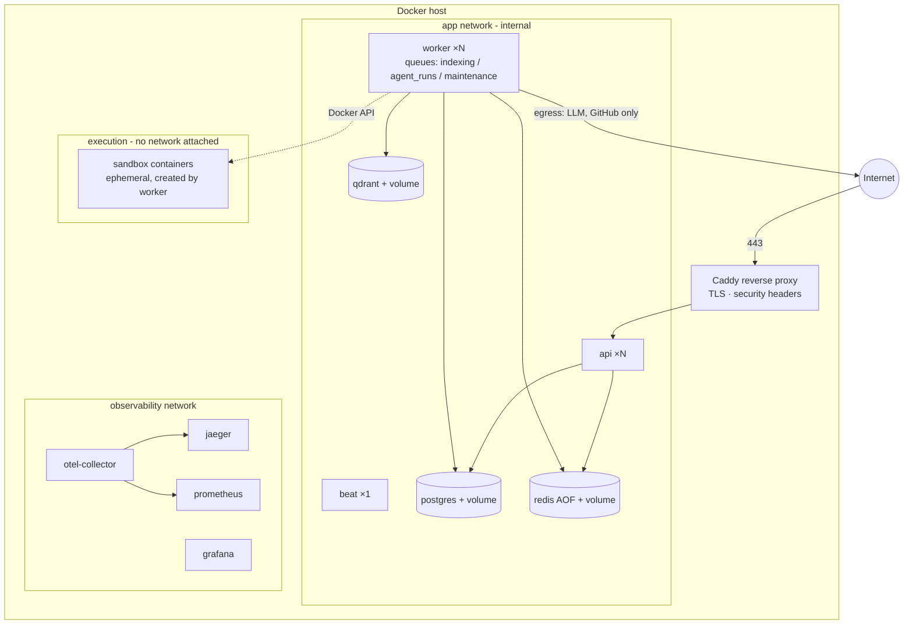

# 12 — Deployment Architecture

Two targets, one design: **Docker Compose is the v1 deliverable; Kubernetes-readiness is a design
constraint from M0** (12-factor, stateless API, env-only config, health/readiness endpoints,
graceful shutdown) with Helm charts delivered in M14. Decision record:
[ADR-0014](adr/0014-kubernetes-readiness.md).

## 1. Deployment diagram (v1 — Compose)



Compose hardening: databases publish **no host ports** (dev override exposes them); every service
has healthchecks, memory/CPU limits, `restart: unless-stopped`, non-root users, read-only rootfs
where possible; the sandbox image is built locally and pinned by digest.

## 2. Kubernetes target

| Concern | Design |
| --- | --- |
| Workloads | `api` Deployment (HPA on CPU/latency) · `worker` Deployments per queue (**KEDA** scaling on Redis Stream/queue depth — queue depth, not CPU, is the true load signal) · `beat` single replica w/ leader election · CronJobs for cleanup |
| State | Postgres/Redis/Qdrant via operator or managed services; charts support `external*` endpoints so prod can point at RDS-like services — **we do not pretend running databases on K8s is free** |
| Config | Helm values → env vars; non-secret config in ConfigMaps; images identical across envs (build once, configure per env) |
| Secrets | External Secrets Operator (preferred, syncs from cloud secret managers) or SOPS-encrypted values as the self-contained fallback; never plain values files |
| Ingress | ingress-nginx + cert-manager (TLS), SSE-aware config (buffering off for the events route, long read timeouts) |
| Network | NetworkPolicies deny-by-default; only api↔db, worker↔db/qdrant, egress allow-list (LLM, GitHub) |
| Pod security | Pod Security Standards `restricted` for all app pods; sandbox executor is the exception path, isolated in its own namespace |

### The sandbox problem on K8s (the one real architectural fork)

The v1 sandbox adapter drives the host Docker socket — **unavailable and unacceptable on K8s**
(socket mount = node compromise; DinD = privileged). The `Sandbox` port therefore gets a second
adapter: **Kubernetes Jobs** — one Job per execution in a dedicated `spidey-exec` namespace with
`restricted` PSS, no service account token, NetworkPolicy `deny-all`, resource limits, and
`activeDeadlineSeconds`; workspace delivered via ephemeral volume. Upgrade path: `runtimeClass:
gvisor` on that namespace for kernel-level isolation. This is precisely why sandboxing was built
behind a port ([ADR-0007](adr/0007-docker-sandbox.md)) — the K8s adapter is new infrastructure
code, zero changes to agents or policy.

## 3. Helm chart layout (delivered M14)

```
deploy/
├── helm/spidey/
│   ├── Chart.yaml · values.yaml · values-prod.example.yaml
│   ├── templates/            # api, workers (per queue), beat, migrations Job (pre-upgrade hook),
│   │                         # ingress, networkpolicies, keda scaledobjects, servicemonitors,
│   │                         # exec-namespace + RBAC for the Jobs sandbox adapter
│   └── charts/               # optional subcharts: postgres/redis/qdrant for non-prod
└── compose/                  # the v1 compose files (moved from infra/)
```

Migrations run as a pre-upgrade Job (Alembic), so app pods never race schema changes.

## 4. Environments & release flow

`dev` (compose, hot reload) → `staging` (compose or K8s, live-model T2 evals) → `prod` (K8s).
Releases: tagged SemVer images, signed (Cosign), SBOM attached; rollback = Helm rollback + Alembic
downgrade discipline (every migration ships a tested downgrade). Runbooks in `docs/runbooks/`:
deploy, backup/restore (PG dumps + Qdrant snapshots + volume strategy), key rotation, incident
response, cost-runaway kill switch (global LLM circuit breaker).
